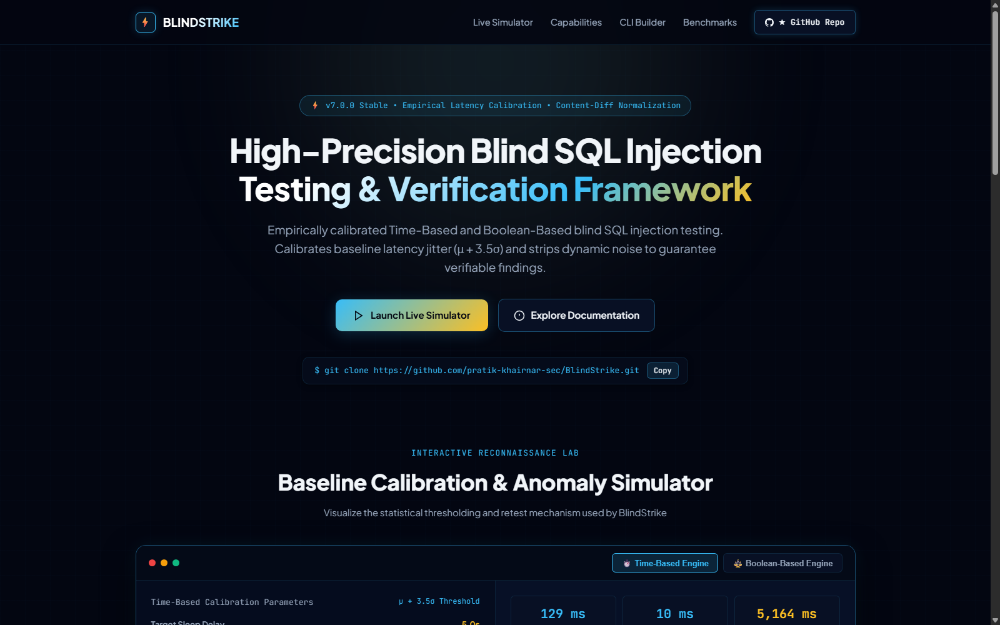
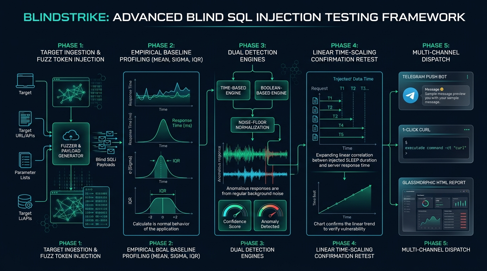
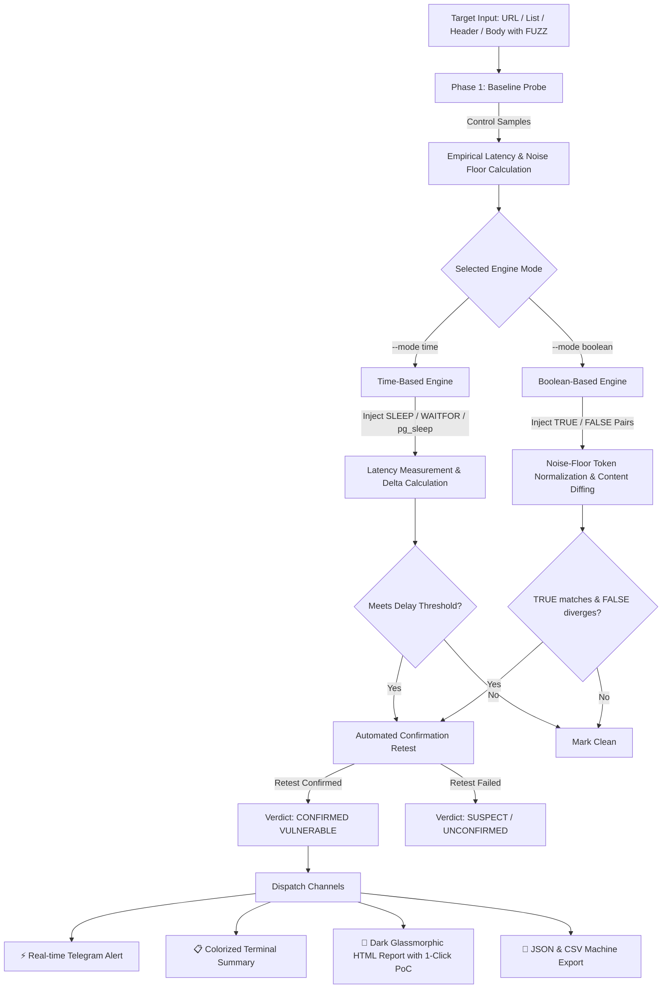
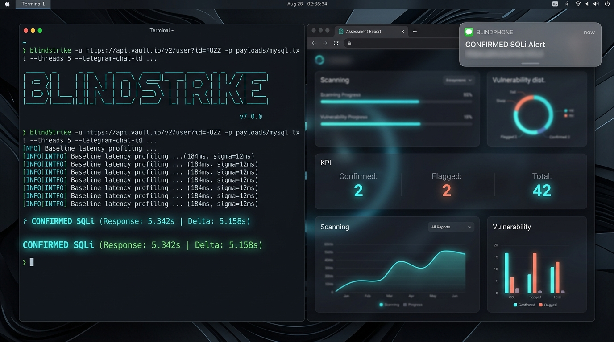

# ⚡ BlindStrike

```text
  ____  _ _           _ ____  _        _ _        
 | __ )| (_)_ __   __| / ___|| |_ _ __(_) | _____ 
 |  _ \| | | '_ \ / _` \___ \| __| '__| | |/ / _ \
 | |_) | | | | | | (_| |___) | |_| |  | |   <  __/
 |____/|_|_|_| |_|\__,_|____/ \__|_|  |_|_|\_\___|
  Advanced Blind SQL Injection Testing Framework
```

<p align="center">
  
  
  
  
  
  
  
</p>

<p align="center">
  <a href="https://pratik-khairnar-sec.github.io/BlindStrike/"></a>
  <a href="https://pratik-khairnar-sec.medium.com/"></a>
  <a href="https://x.com/PratikSec/status/2108584870293451190"></a>
  <a href="https://pratik-khairnar-sec.github.io/portfolio/"></a>
  <a href="https://discord.com/users/1531910259080167494"></a>
</p>

<p align="center">
  
</p>

> 🎯 **BlindStrike** is a precision-engineered, lightweight security framework for identifying **Time-Based** and **Boolean-Based Blind SQL Injection** flaws in authorized bug bounty targets, web applications, and APIs. Featuring empirical baseline latency calibration, noise-floor content normalization, automated confirmation retests, real-time Telegram alerts, and glassmorphic HTML PoC reports.

---

## 📑 Table of Contents

- [🌟 Executive Summary](#-executive-summary)
- [🎯 Why BlindStrike? (The Core Problem Solved)](#-why-blindstrike-the-core-problem-solved)
- [⚖️ Tool Comparison Matrix](#️-tool-comparison-matrix)
- [🏗️ Architectural Pipeline & Execution Flow](#️-architectural-pipeline--execution-flow)
- [🚀 Quick Start & Installation](#-quick-start--installation)
- [💻 Practical Workflows & Real-World Scenarios](#-practical-workflows--real-world-scenarios)
  - [1. Single URL Classic Append Mode](#1-single-url-classic-append-mode)
  - [2. Precise Injection Point with `FUZZ`](#2-precise-injection-point-with-fuzz)
  - [3. POST / PUT / PATCH Body Injection (JSON & Form)](#3-post--put--patch-body-injection-json--form)
  - [4. Custom HTTP Header Injection](#4-custom-http-header-injection)
  - [5. Boolean-Based Content-Diff Detection](#5-boolean-based-content-diff-detection)
  - [6. Multi-Threaded Target List Scanning](#6-multi-threaded-target-list-scanning)
  - [7. Fast Triage with `--stop-on-confirm`](#7-fast-triage-with---stop-on-confirm)
  - [8. Upstream Proxy (Burp Suite / OWASP ZAP) Routing](#8-upstream-proxy-burp-suite--owasp-zap-routing)
  - [9. Persistent Telegram Notifications & Live Document Upload](#9-persistent-telegram-notifications--live-document-upload)
  - [10. Guided Interactive Setup Wizard](#10-guided-interactive-setup-wizard)
- [📦 Database Payload Sets](#-database-payload-sets)
- [📊 Executive Reporting & 1-Click PoC](#-executive-reporting--1-click-poc)
- [⌨️ Complete CLI Flags Reference](#️-complete-cli-flags-reference)
- [🛡️ Ethical Conduct & Legal Disclaimer](#️-ethical-conduct--legal-disclaimer)
- [👤 Author & Contributions](#-author--contributions)

---

## 🌟 Executive Summary

Traditional SQL injection tools like SQLMap and Ghauri are outstanding for full-scale exploitation and database extraction, but they can be heavy-handed, noisy against web application firewalls (WAFs), and prone to false positives when encountering network latency jitter or dynamic website elements.

Created by **[Pratik Khairnar (@pratik-khairnar-sec)](https://github.com/pratik-khairnar-sec)**, **BlindStrike** was purpose-built from the ground up to address these specific pain points. It is designed to be:
- **Surgically Precise:** Tests only blind injection vectors without triggering aggressive WAF heuristics.
- **Scientifically Grounded:** Uses empirical latency baselines and dynamic noise-floor normalization instead of arbitrary timing thresholds.
- **Empirical Statistical Verification:** Every flagged anomaly is subjected to an independent confirmation retest before being branded as `CONFIRMED`.
- **Triager-Ready:** Produces instant `curl` commands, structured JSON/CSV telemetry, and interactive HTML audit dashboards ready for bug bounty report submissions.

---

## 🎯 Why BlindStrike? (The Core Problem Solved)

Blind SQL Injection is notoriously deceptive:
1. **Network Jitter False Positives:** A congested WiFi connection or a slow database query can easily make a 5-second sleep test appear positive on an innocent endpoint. BlindStrike measures a multi-request **control baseline** and calculates the exact `delta` before flagging.
2. **Boolean Noise Floor:** Real-world web applications constantly change between requests due to CSRF tokens, rotating ads, live view counters, and dynamic timestamps. BlindStrike's token-normalizing engine strips out numeric noise and computes mathematical similarity thresholds, ensuring genuine SQL logic changes are clearly separated from background noise.
3. **WAF Evasion & Multi-Point Injection:** Injects seamlessly via the `FUZZ` token anywhere in GET parameters, JSON keys, XML bodies, or HTTP headers (e.g. `X-Forwarded-For`, `User-Agent`).

---

## ⚖️ Tool Comparison Matrix

| Feature | BlindStrike v7.0 | SQLMap | Ghauri | Manual Curl |
|---|:---:|:---:|:---:|:---:|
| **Baseline Latency Calibration** | ✅ **Automatic (Multi-sample)** | ⚠️ Manual (`--time-sec`) | ⚠️ Basic | ❌ Manual math |
| **Independent Confirmation Retest** | ✅ **Built-in (`CONFIRMED`)** | ⚠️ Partial | ❌ No | ❌ Manual repeat |
| **Boolean Noise-Floor Normalizer** | ✅ **Collapses Dynamic Tokens** | ⚠️ String-based | ⚠️ Basic | ❌ Diff viewer needed |
| **Real-Time Telegram Push Alerts** | ✅ **Instant on Confirm** | ❌ No native bot | ❌ No | ❌ Custom webhook |
| **Automatic Report File Upload** | ✅ **Sends JSON/CSV/HTML docs**| ❌ No | ❌ No | ❌ No |
| **1-Click Copy `curl` PoC** | ✅ **In HTML Report** | ❌ Log only | ❌ No | ❌ Manual crafting |
| **Interactive Guided Wizard** | ✅ **Zero-arg on-ramp** | ⚠️ Wizard mode | ❌ Flag only | ❌ No |
| **Installation Footprint** | ⚡ **Pure Python (2 deps)** | 20+ MB codebase | Python package | Preinstalled |

---

## 🏗️ Architectural Pipeline & Execution Flow

<p align="center">
  
</p>



---

## 🚀 Quick Start & Installation

BlindStrike requires **Python 3.8+** and only two lightweight dependencies (`requests` and `urllib3`).

### Method 1: Global Pip Install (Recommended)

Install BlindStrike globally on your system to run the `blindstrike` command from any terminal:

```bash
git clone https://github.com/pratik-khairnar-sec/BlindStrike.git
cd BlindStrike
pip install .
```

Verify your installation:
```bash
blindstrike --version
```

### Method 2: Clone & Run Directly

```bash
git clone https://github.com/pratik-khairnar-sec/BlindStrike.git
cd BlindStrike
pip install -r requirements.txt
python blindstrike.py --help
```

---

## 💻 Practical Workflows & Real-World Scenarios

### 1. Single URL Classic Append Mode
If your parameter is at the end of the query string:
```bash
blindstrike -u "https://target.com/products?category=1" -p payloads/mysql.txt
```

### 2. Precise Injection Point with `FUZZ`
Place the `FUZZ` token anywhere in the URL to mark the exact injection site:
```bash
blindstrike -u "https://target.com/api/v1/user/FUZZ/profile" -p payloads/postgresql.txt
```

### 3. POST / PUT / PATCH Body Injection (JSON & Form)
Test APIs and authentication endpoints:
```bash
# JSON Body Injection
blindstrike -u "https://target.com/api/login" -X POST \
  -d '{"username": "admin", "password": "FUZZ"}' \
  -H "Content-Type: application/json" -p payloads/mssql.txt

# Form URL-Encoded
blindstrike -u "https://target.com/search" -X POST \
  -d "query=electronicsFUZZ&sort=asc" -p payloads/mysql.txt
```

### 4. Custom HTTP Header Injection
Test for SQL injection hidden inside incoming request headers:
```bash
blindstrike -u "https://target.com/dashboard" \
  --header-name "X-Forwarded-For" -p payloads/generic.txt
```

### 5. Boolean-Based Content-Diff Detection
Detect blind SQL injection when timing delays are restricted by the server:
```bash
blindstrike -u "https://target.com/items?id=1FUZZ" \
  -p payloads/boolean_generic.txt --mode boolean -v
```

### 6. Multi-Threaded Target List Scanning
Test hundreds of endpoints extracted from your recon pipelines:
```bash
blindstrike -l endpoints.txt -p payloads/generic.txt -t 10 \
  --html-report report.html --csv-report report.csv --report report.json
```

### 7. Fast Triage with `--stop-on-confirm`
Stop scanning a target immediately upon finding the first confirmed vulnerability:
```bash
blindstrike -u "https://target.com/item?id=FUZZ" \
  -p payloads/mysql.txt --stop-on-confirm
```

### 8. Upstream Proxy (Burp Suite / OWASP ZAP) Routing
Route all test requests through Burp Suite for manual inspection:
```bash
blindstrike -u "https://target.com/account?id=1FUZZ" \
  -p payloads/oracle.txt --proxy "http://127.0.0.1:8080" --insecure
```

### 9. Persistent Telegram Notifications & Live Document Upload
Configure Telegram once, and all future scans automatically alert your bot:
```bash
blindstrike -l urls.txt -p payloads/generic.txt -t 8 \
  --telegram-token "123456789:ABCdefGHIjklMNOpqrsTUVwxyz1234" \
  --telegram-chat-id "987654321" \
  --html-report audit.html
```

> 🔒 **Security Guarantee:** BlindStrike strictly transmits vulnerability status, target URLs, and generated report attachments to Telegram. Cookies, session tokens, and `Authorization` headers are structurally excluded from all Telegram API payloads.

### 10. Guided Interactive Setup Wizard
Running BlindStrike with zero arguments launches an interactive step-by-step assistant:
```bash
blindstrike
```

---

## 📦 Database Payload Sets

Pre-compiled, field-tested payload libraries located in the `payloads/` directory:

| Payload File | Target RDBMS | Primary Mechanics |
|---|---|---|
| [`payloads/mysql.txt`](payloads/mysql.txt) | **MySQL / MariaDB** | `SLEEP()`, `BENCHMARK()`, stacked queries, arithmetic delays |
| [`payloads/mssql.txt`](payloads/mssql.txt) | **Microsoft SQL Server** | `WAITFOR DELAY`, heavy math routines, stacked transactions |
| [`payloads/postgresql.txt`](payloads/postgresql.txt) | **PostgreSQL** | `pg_sleep()`, heavy regex calculations, casting injections |
| [`payloads/oracle.txt`](payloads/oracle.txt) | **Oracle Database** | `DBMS_LOCK.SLEEP()`, heavy joins, `UTL_HTTP` timeouts |
| [`payloads/generic.txt`](payloads/generic.txt) | **Universal Polyglot** | Broad multi-engine syntax for initial triage |
| [`payloads/xor.txt`](payloads/xor.txt) | **XOR Arithmetic** | Filter and WAF bypass using bitwise XOR delay equations |
| [`payloads/boolean_generic.txt`](payloads/boolean_generic.txt) | **Boolean TRUE/FALSE** | Paired conditional queries separated by `\|\|\|` |

---

## 📊 Executive Reporting & 1-Click PoC

<p align="center">
  
</p>

BlindStrike generates standalone, dark-glassmorphic HTML reports (`--html-report report.html`):

- **Executive KPI Cards:** Instant overview of total scans, flagged suspect hits, and confirmed vulnerabilities.
- **Copy curl PoC:** Click the **📋 Copy curl PoC** button on any confirmed finding to copy an executable command directly to your clipboard.
- **Live Search & Filter:** Filter results dynamically by `All`, `Confirmed Only`, or `Suspect Only`.
- **Print / PDF Ready:** Fully styled `@media print` layout for exporting directly to client-ready PDFs.

---

## ⌨️ Complete CLI Flags Reference

| Flag | Argument | Default | Description |
|---|---|---|---|
| `-u, --url` | `STRING` | None | Single target URL. Use `FUZZ` to specify the exact injection point. |
| `-l, --list` | `FILE` | None | Path to a file containing one URL per line (`#` comments allowed). |
| `-p, --payloads` | `FILE` | None | Path to payload file (see `payloads/`). Required. |
| `--mode` | `time\|boolean` | `time` | Detection mode: Time-based delay or Boolean content-diff. |
| `-X, --method` | `STRING` | `GET` | HTTP Method (`GET`, `POST`, `PUT`, `PATCH`, `DELETE`). |
| `-d, --data` | `STRING` | None | Request body for POST/PUT/PATCH. Supports `FUZZ` marker. |
| `-H, --header` | `STRING` | None | Extra custom header (e.g. `-H "X-API-Key: 123"`). May be repeated. |
| `--header-name` | `STRING` | None | Injects payloads into the specified HTTP header value. |
| `-c, --cookie` | `STRING` | None | HTTP Cookie string for authenticated session testing. |
| `-t, --threads` | `INT` | `0` | Concurrent worker threads (`0` = sequential, max `20`). |
| `--threshold` | `FLOAT` | `5.0` | Minimum response delay (in seconds) to flag time-based SQLi. |
| `--timeout` | `FLOAT` | `15.0` | HTTP request timeout in seconds. |
| `--baseline-count` | `INT` | `2` | Number of un-injected baseline control requests per target. |
| `--stop-on-confirm`| `FLAG` | `False` | Halts further requests immediately upon the first confirmed hit. |
| `--no-confirm` | `FLAG` | `False` | Skips independent confirmation retest (flags on first hit). |
| `--proxy` | `URL` | None | Upstream proxy URL (e.g. `http://127.0.0.1:8080`). |
| `--insecure` | `FLAG` | `False` | Disables TLS certificate verification. |
| `--telegram-token` | `STRING` | Saved config | Telegram Bot Token from `@BotFather`. |
| `--telegram-chat-id` | `STRING` | Saved config | Telegram Chat ID from `@userinfobot`. |
| `--no-save-telegram`| `FLAG` | `False` | Do not persist Telegram credentials to disk. |
| `--html-report` | `FILE` | None | Path to export interactive HTML assessment report. |
| `--csv-report` | `FILE` | None | Path to export structured CSV results. |
| `--report` | `FILE` | None | Path to export detailed JSON telemetry. |
| `-o, --output` | `FILE` | None | Path to export vulnerable URLs as plain text. |
| `-v, --verbose` | `FLAG` | `False` | Verbose output (displays non-vulnerable requests). |
| `--no-color` | `FLAG` | `False` | Disables ANSI terminal coloring. |
| `--no-banner` | `FLAG` | `False` | Suppresses ASCII header banner. |

---

## 🛡️ Ethical Conduct & Legal Disclaimer

> [!CAUTION]
> **BlindStrike is intended strictly for authorized security assessments, professional penetration testing, and legitimate bug bounty research with written scope authorization.**  
> Testing assets without explicit permission violates international cyber laws (including the US Computer Fraud and Abuse Act, UK Computer Misuse Act, and Indian Information Technology Act). The author (**Pratik Khairnar**) assumes zero liability for unauthorized usage or operational disruption.

---

## 👤 Author & Contributions

Created and maintained with precision by **[Pratik Khairnar (@pratik-khairnar-sec)](https://github.com/pratik-khairnar-sec)**.

- **GitHub:** [@pratik-khairnar-sec](https://github.com/pratik-khairnar-sec)
- **Framework:** [BlindStrike Repository](https://github.com/pratik-khairnar-sec/BlindStrike)
- **Companion Recon Suite:** [ReconForge v3](https://github.com/pratik-khairnar-sec/ReconForge)

⭐ If BlindStrike helped you identify a high-severity SQL injection or streamlined your testing workflow, please star the repository on GitHub!
